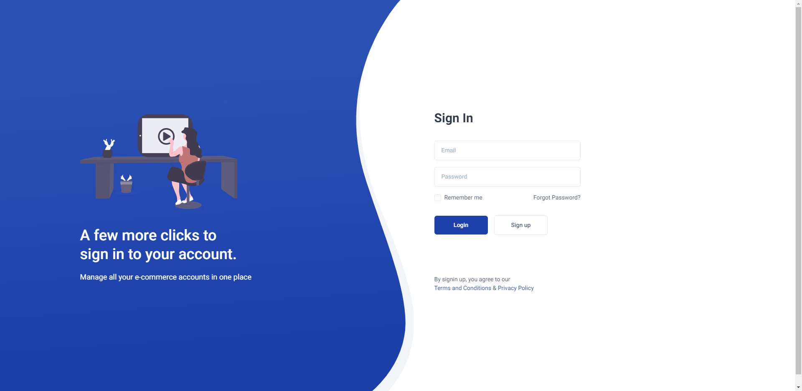
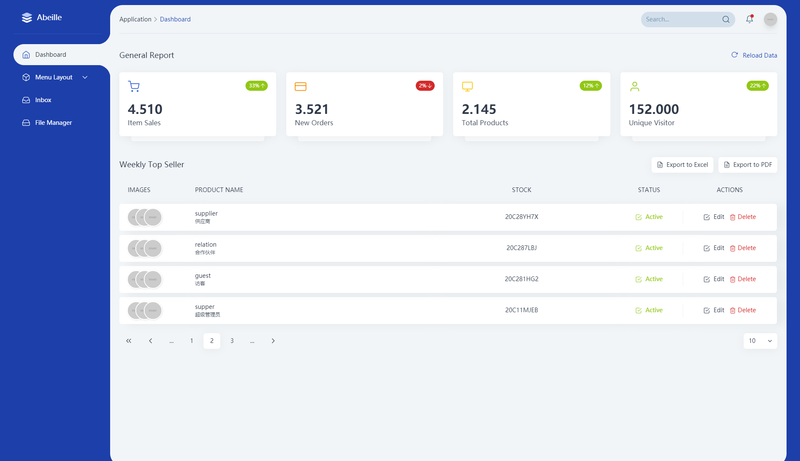

# Leafage

<p align="center">
  <a href="https://console.abeille.top" target="_blank">
    
  </a>
</p>

<p align="center">
  <br>
  <a href="https://github.com/little3201/leafage-ms/blob/master/LICENSE">
    
  </a>
</p>

## 项目介绍

一个使用 Vue3、 Tailwindcss 的网站管理系统，致力于促进管理系统界面更好的体验。
包含帖子管理、影视资料管理、权限管理。

### 目标功能
- [x] 登录注册
- [x] 权限管理
- [x] 个人中心
- [ ] 消息提醒
- [ ] 自定义主题
- [ ] 全文检索/站内搜索
- [ ] 动画
- [x] 响应式


### 站点体验
访问地址：https://console.abeille.top

### 展示截图




### 项目地址

目前项目托管在Gitee和Github平台上中，欢迎大家star 和 fork 支持~

- Gitee地址：https://gitee.com/little3201/abeille-manager
- Github地址：https://github.com/little3201/abeille-manager

### FAQ文档

[FAQ文档](FAQ.md)

如果你遇到了 [FAQ文档](FAQ.md) 中没有出现的问题，并且已经解决了，欢迎联系我进行修改。


### 前端技术

|         技术          |           说明            |                             链接                            |
|:---------------------:|:------------------------:|:-----------------------------------------------------------:|
|        Vue.js         |         开发框架          |         [https://vuejs.org](https://vuejs.org)              |
|      Tailwindcss      |          CSS库            |       [https://tailwindcss.com](https://tailwindcss.com)    |
|         Axios         |       前端HTTP框架        |     [https://github.com/axios](https://github.com/axios)    |

## Project setup
```
yarn install
```

### Compiles and hot-reloads for development
```
yarn dev
```

### Compiles and minifies for production
```
yarn build
```

<a href="https://github.com/little3201/leafage-ms/blob/master/LICENSE">
  <h2>MIT</h2>
</a>
